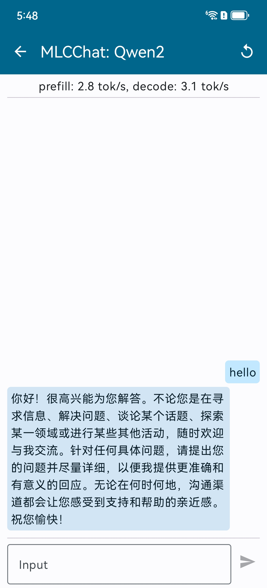

# edge-llms-challenge-anonymous-team

> [!IMPORTANT]  
> [2024/10/20] In accordance with the latest instructions from the Discord server, we have completed the following checklist:
> - [x] Included the **bundle_weight tool (`test.py`)** in the `mlc_llm.zip` file containing the APK and compiled model.
>   - You can execute `bash push_apk.sh` on your (UNIX-like) adb host computer to deploy the MLC app and bundled weights to the test device.
> - [x] Added a [screenshot](#preliminary-review) showing a successful test run of our preliminary submission.
> - [x] Provided code for model conversion & config generation used in our submission:
<details open>
<summary> Windows batch file (.bat) automating `convert_weight` & `gen_config`: </summary>

```Batchfile
@echo off
setlocal

REM Set MODEL_VERSION
set MODEL_VERSION=xxxxxxx

REM Convert Weights
echo Running command 1: Convert weights
mlc_llm convert_weight ./dist/models/%MODEL_VERSION%/ --quantization q0f16 -o dist/bundle/%MODEL_VERSION%/

REM Generate Config
echo Running command 2: Generate config
mlc_llm gen_config ./dist/models/%MODEL_VERSION%/ --quantization q0f16 --context-window-size 2048 --prefill-chunk-size=1 --max-batch-size=1 -o dist/bundle/%MODEL_VERSION%/

endlocal
```
</details>

## Preliminary Review
For the preliminary review, we submit two compressed models:
- Qwen2-7B-Instruct (Pruned to 3.86B)
- Llama-3.1-8B-Instruct (Pruned to 4.31B)

We plan to update model weights in our final submission.

**Note:** We have **successfully tested** the on-device inference of the submitted 3.86B model on a local test device.

